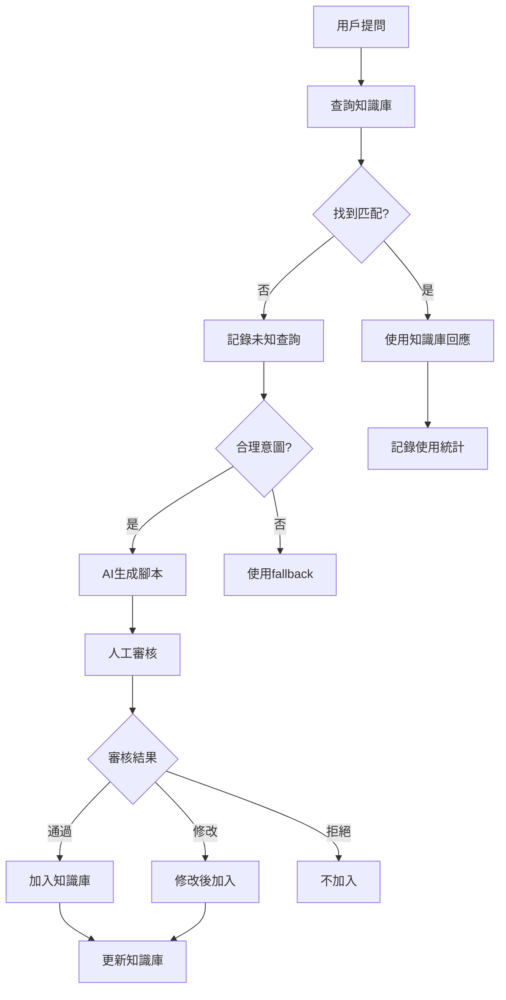

# 高文文回應腳本管理系統 - 完整部署與使用指南

## 🎯 系統概述

### 核心功能流程
```
用戶提問 → 未知查詢檢測 → AI生成腳本 → 人工審核 → 知識庫整合 → 高文文使用
```

### 系統架構
- **數據庫層**：7個核心表格，完整的審核工作流程
- **API層**：RESTful接口，支持所有管理操作
- **管理界面**：React後台，可視化審核和管理
- **知識庫服務**：智能匹配和回應生成
- **聊天整合**：Claude Chat V3，知識庫驅動

---

## 🚀 部署步驟

### 1. 數據庫部署

```sql
-- 執行數據庫 schema
psql -h [SUPABASE_HOST] -U postgres -d postgres -f scripts/response-script-management-schema.sql
```

**核心表格**：
- `unknown_user_queries` - 未知查詢記錄
- `generated_response_scripts` - AI生成腳本
- `script_review_records` - 人工審核記錄
- `training_knowledge_base` - 訓練資料知識庫
- `script_usage_analytics` - 使用統計分析

### 2. API部署

```bash
# 部署回應腳本管理 API
supabase functions deploy response-script-management --project-ref [YOUR_PROJECT]

# 部署新版聊天系統
supabase functions deploy claude-chat-v3 --project-ref [YOUR_PROJECT]
```

### 3. 前端整合

```tsx
// 在管理後台中加入新組件
import ResponseScriptManagement from '@/components/admin/ResponseScriptManagement'

// 在路由中添加
<Route path="/admin/response-scripts" component={ResponseScriptManagement} />
```

### 4. 環境變數設定

```env
# Supabase 設定
SUPABASE_URL=your_supabase_url
SUPABASE_SERVICE_ROLE_KEY=your_service_role_key

# API 端點
RESPONSE_SCRIPT_API_URL=/functions/v1/response-script-management
CLAUDE_CHAT_V3_URL=/functions/v1/claude-chat-v3
```

---

## 📖 使用指南

### 管理員操作流程

#### 1. 監控未知查詢
```typescript
// 查看待處理的未知查詢
const pendingQueries = await fetch('/api/response-script-management', {
  method: 'POST',
  headers: { 'Content-Type': 'application/json' },
  body: JSON.stringify({
    action: 'get_pending_queries',
    data: { limit: 20 }
  })
})
```

#### 2. AI腳本生成
- 系統自動檢測合理意圖 (信心度 > 0.7)
- 觸發AI生成回應腳本
- 腳本進入待審核佇列

#### 3. 人工審核流程
**審核標準**：
- ✅ **通過 (approved)**：直接加入知識庫
- ⚠️ **需修改 (needs_revision)**：修改後加入知識庫
- ❌ **拒絕 (rejected)**：不加入知識庫

**評分維度**：
- 準確性 (30%)
- 語氣友善度 (20%)
- 內容完整性 (30%)
- 實用性 (20%)

#### 4. 知識庫管理
```typescript
// 搜索知識庫
const knowledge = await knowledgeService.findBestMatch(userQuery, context)

// 生成個性化回應
const response = await knowledgeService.generateResponse(knowledge, context)
```

---

## 🔧 API 接口說明

### 核心 API 端點

#### 未知查詢管理
```javascript
// 記錄未知查詢
POST /functions/v1/response-script-management
{
  "action": "record_unknown_query",
  "data": {
    "session_id": "session-123",
    "original_question": "用戶問題",
    "detected_intent": "FOOD",
    "confidence_score": 0.8
  }
}

// 獲取待處理查詢
POST /functions/v1/response-script-management
{
  "action": "get_pending_queries",
  "data": { "limit": 20 }
}
```

#### 腳本生成與審核
```javascript
// 生成回應腳本
POST /functions/v1/response-script-management
{
  "action": "generate_script",
  "data": {
    "query_id": 123,
    "query": { /* query object */ }
  }
}

// 提交審核結果
POST /functions/v1/response-script-management
{
  "action": "submit_review",
  "data": {
    "script_id": 456,
    "reviewer_id": "admin-001",
    "review_status": "approved",
    "review_score": 85,
    "review_comments": "內容準確，語氣友善"
  }
}
```

#### 知識庫查詢
```javascript
// 搜索知識庫
POST /functions/v1/response-script-management
{
  "action": "search_knowledge",
  "data": {
    "query": "美食推薦",
    "category": "FOOD",
    "limit": 10
  }
}

// 記錄使用統計
POST /functions/v1/response-script-management
{
  "action": "record_usage",
  "data": {
    "knowledge_id": 789,
    "usage_data": {
      "session_id": "session-123",
      "user_question": "推薦美食",
      "user_feedback": "positive"
    }
  }
}
```

---

## 🎮 後台管理介面

### 主要功能頁面

#### 1. 未知查詢頁面
- 📋 查看所有未處理的用戶查詢
- 🧠 一鍵觸發AI腳本生成
- 👁️ 查看查詢詳情和分析結果
- 🏷️ 手動標記意圖類型

#### 2. 腳本審核頁面
- 📝 查看AI生成的回應腳本
- ⭐ 評分和評論系統
- ✏️ 在線修改腳本內容
- ✅ 批准/拒絕/要求修改

#### 3. 知識庫管理
- 🔍 搜索和瀏覽知識庫條目
- 📊 查看使用統計和成功率
- 🔄 啟用/停用知識條目
- 📈 品質分數管理

#### 4. 分析統計頁面
- 📊 審核通過率和平均評分
- 📈 知識庫成長趨勢
- 👥 審核員績效統計
- 🎯 用戶滿意度分析

---

## 🚦 系統工作流程

### 正常運作流程



### 品質控制機制

1. **自動檢測**：垃圾內容、重複查詢、無意義輸入
2. **AI生成品質**：模板結構、語氣一致性、內容相關性
3. **人工審核**：準確性、實用性、語氣友善度
4. **使用者反饋**：成功率統計、用戶評分
5. **持續優化**：低品質條目自動標記、定期清理

---

## 📊 監控和維護

### 關鍵指標監控

```sql
-- 每日新增未知查詢數
SELECT DATE(created_at), COUNT(*)
FROM unknown_user_queries
WHERE created_at >= NOW() - INTERVAL '7 days'
GROUP BY DATE(created_at);

-- 審核通過率
SELECT
  review_status,
  COUNT(*) as count,
  ROUND(COUNT(*) * 100.0 / SUM(COUNT(*)) OVER(), 2) as percentage
FROM script_review_records
GROUP BY review_status;

-- 知識庫使用統計
SELECT
  tkb.intent_category,
  COUNT(sua.id) as usage_count,
  AVG(sua.user_rating) as avg_rating
FROM training_knowledge_base tkb
LEFT JOIN script_usage_analytics sua ON tkb.id = sua.knowledge_id
GROUP BY tkb.intent_category;
```

### 定期維護任務

#### 每日檢查
- [ ] 檢查待審核腳本數量
- [ ] 監控系統錯誤日誌
- [ ] 查看用戶滿意度指標

#### 每週分析
- [ ] 審核通過率趨勢
- [ ] 知識庫成長情況
- [ ] 低品質條目識別和處理

#### 每月優化
- [ ] 清理過期和無效條目
- [ ] 更新腳本模板
- [ ] 系統性能調優

---

## 🛠️ 故障排除

### 常見問題及解決方案

#### 1. AI腳本生成失敗
```bash
# 檢查 Edge Function 狀態
supabase functions list

# 查看錯誤日誌
supabase functions logs response-script-management
```

**可能原因**：
- ❌ API配額超限
- ❌ 數據庫連接問題
- ❌ 輸入數據格式錯誤

**解決方案**：
- ✅ 檢查 Supabase 用量
- ✅ 驗證數據庫連接
- ✅ 檢查輸入數據格式

#### 2. 知識庫匹配度過低
```typescript
// 調整匹配閾值
const CONFIDENCE_THRESHOLD = 0.5 // 降低閾值

// 增加關鍵字權重
const keywordScore = calculateKeywordScore(keywords) * 1.2
```

#### 3. 審核流程卡住
```sql
-- 檢查待審核腳本
SELECT COUNT(*) FROM generated_response_scripts grs
LEFT JOIN script_review_records srr ON grs.id = srr.script_id
WHERE srr.id IS NULL;

-- 重置異常狀態
UPDATE unknown_user_queries
SET status = 'pending'
WHERE status = 'analyzing' AND created_at < NOW() - INTERVAL '1 hour';
```

---

## 📈 系統擴展建議

### 短期改進 (1個月內)
1. **增強AI生成**：整合更先進的語言模型
2. **批量審核**：支持批量操作和快捷審核
3. **移動端優化**：響應式審核界面
4. **通知系統**：郵件/Slack通知待審核項目

### 中期發展 (3個月內)
1. **多語言支持**：英文、日文回應腳本
2. **A/B測試**：回應效果對比測試
3. **自動化審核**：基於規則的預審核系統
4. **用戶反饋整合**：直接收集用戶評價

### 長期規劃 (6個月+)
1. **機器學習優化**：基於使用數據的自動改進
2. **跨平台整合**：LINE、Facebook整合
3. **情感分析**：用戶情緒識別和回應調整
4. **多Agent協作**：專業領域分工合作

---

## 🔒 安全性考量

### 數據安全
- ✅ 所有敏感數據加密存儲
- ✅ API接口身份驗證
- ✅ 操作日誌完整記錄
- ✅ 定期安全審計

### 內容安全
- ✅ 自動檢測有害內容
- ✅ 人工審核雙重保障
- ✅ 內容版權檢查
- ✅ 敏感信息過濾

### 系統安全
- ✅ 限制API調用頻率
- ✅ 防止SQL注入攻擊
- ✅ 輸入數據驗證
- ✅ 錯誤信息脫敏

---

*最後更新：2025-09-25*
*版本：v1.0*
*系統名稱：高文文回應腳本管理系統*